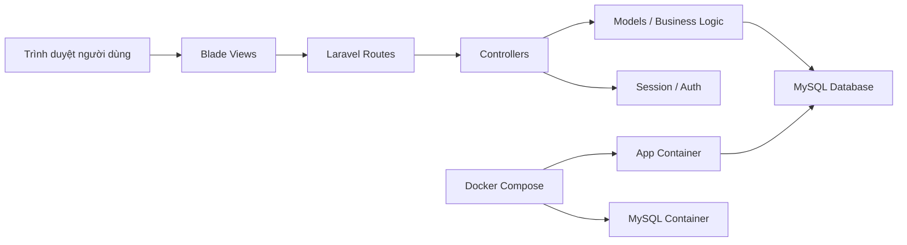
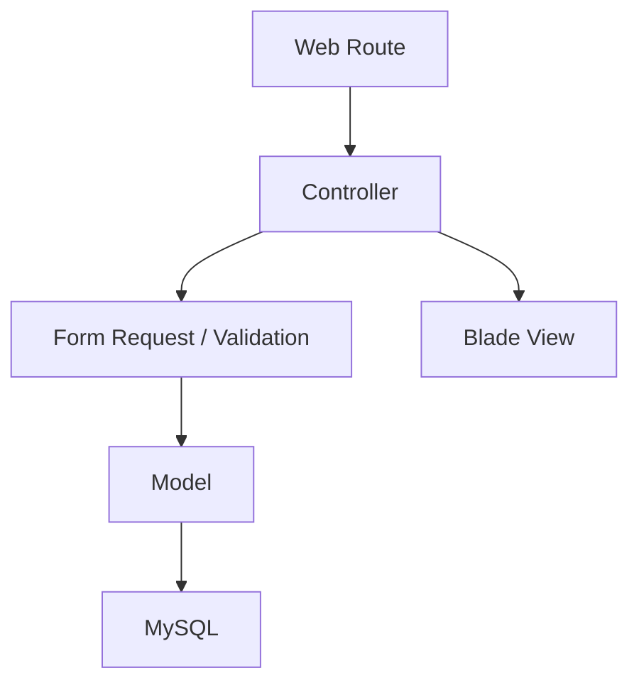
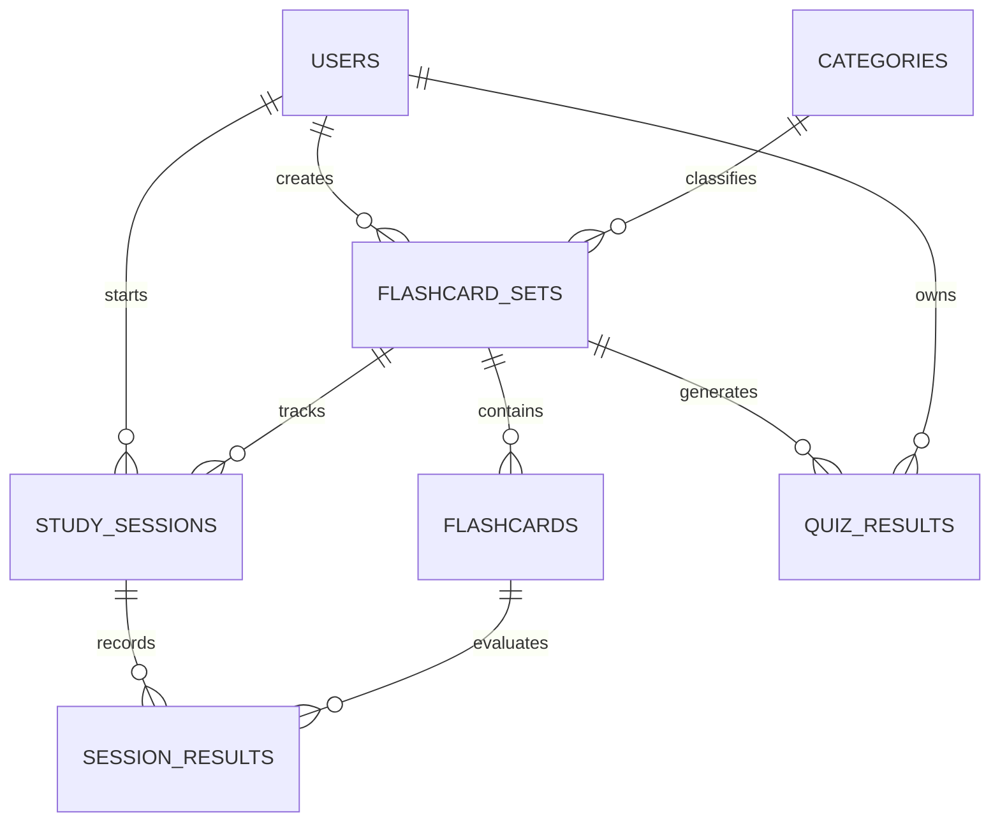

## 1. Thiết Kế Kiến Trúc


## 2. Mô Tả Công Nghệ
- Backend: Laravel 12 + PHP 8.3
- Frontend server-rendered: Blade Template + Bootstrap hoặc CSS tùy biến nhẹ
- Database: MySQL 8
- Mô hình: MVC chuẩn Laravel
- Xác thực: Laravel built-in auth hoặc Breeze bản Blade
- Môi trường chạy local: Docker Compose
- Web server trong container: Apache thông qua image PHP + Laravel hoặc image dựng sẵn cho app

## 3. Định Nghĩa Route
| Route | Mục đích |
|-------|----------|
| `/` | Trang chủ giới thiệu hệ thống và bộ thẻ nổi bật |
| `/register` | Đăng ký học viên |
| `/login` | Đăng nhập hệ thống |
| `/dashboard` | Dashboard học viên sau đăng nhập |
| `/flashcard-sets` | Danh sách bộ flashcard của người dùng |
| `/flashcard-sets/create` | Form tạo bộ flashcard |
| `/flashcard-sets/{id}/edit` | Form chỉnh sửa bộ flashcard |
| `/flashcard-sets/{id}/cards` | Quản lý các flashcard thuộc bộ |
| `/study-sessions/{setId}/start` | Khởi tạo phiên học |
| `/study-sessions/{sessionId}` | Màn hình học flashcard |
| `/study-sessions/{sessionId}/answer` | Ghi nhận phản hồi nhớ/chưa nhớ |
| `/quiz/{setId}` | Làm quiz nhanh từ một bộ thẻ |
| `/progress` | Xem tiến độ và lịch sử học |
| `/admin` | Dashboard quản trị |
| `/admin/categories` | CRUD danh mục |
| `/admin/users` | Quản lý người dùng |
| `/admin/public-sets` | Quản lý bộ thẻ công khai |

## 4. Định Nghĩa Xử Lý Nghiệp Vụ
### 4.1 Controller Chính
- `HomeController`: hiển thị trang chủ và dữ liệu giới thiệu.
- `DashboardController`: tổng hợp số liệu học tập của học viên.
- `FlashcardSetController`: CRUD bộ flashcard.
- `FlashcardController`: CRUD thẻ học trong một bộ.
- `StudySessionController`: khởi tạo phiên học, hiển thị thẻ tiếp theo, lưu phản hồi học tập.
- `QuizController`: tạo bài quiz ngắn từ flashcard và chấm kết quả.
- `ProgressController`: hiển thị lịch sử học và các chỉ số tiến độ.
- `AdminController`: trang quản trị tổng quan.
- `CategoryController`: CRUD danh mục học tập cho admin.

### 4.2 Luồng Xử Lý Mẫu
1. Người dùng tạo bộ flashcard trong `FlashcardSetController`.
2. Người dùng thêm từng flashcard qua `FlashcardController`.
3. Khi bắt đầu học, `StudySessionController` tạo bản ghi phiên học.
4. Mỗi lần người dùng chọn "đã nhớ" hoặc "chưa nhớ", hệ thống lưu vào bảng kết quả phiên học.
5. `ProgressController` tổng hợp dữ liệu để hiển thị tỷ lệ ghi nhớ và lịch sử.

## 5. Sơ Đồ Kiến Trúc Server


## 6. Mô Hình Dữ Liệu
### 6.1 Định Nghĩa Thực Thể


### 6.2 Danh Sách Bảng
| Bảng | Mục đích | Quan hệ chính |
|------|----------|---------------|
| `users` | Lưu tài khoản học viên và admin | 1-n với `flashcard_sets`, `study_sessions`, `quiz_results` |
| `categories` | Danh mục chủ đề học tập | 1-n với `flashcard_sets` |
| `flashcard_sets` | Thông tin bộ flashcard | n-1 với `users`, n-1 với `categories`, 1-n với `flashcards` |
| `flashcards` | Từng thẻ hỏi/đáp | n-1 với `flashcard_sets` |
| `study_sessions` | Phiên học của người dùng | n-1 với `users`, n-1 với `flashcard_sets` |
| `session_results` | Kết quả từng thẻ trong phiên | n-1 với `study_sessions`, n-1 với `flashcards` |
| `quiz_results` | Kết quả quiz nhanh | n-1 với `users`, n-1 với `flashcard_sets` |

### 6.3 DDL Tham Khảo
```sql
CREATE TABLE categories (
    id BIGINT UNSIGNED AUTO_INCREMENT PRIMARY KEY,
    name VARCHAR(100) NOT NULL,
    description VARCHAR(255) NULL,
    created_at TIMESTAMP NULL,
    updated_at TIMESTAMP NULL
);

CREATE TABLE flashcard_sets (
    id BIGINT UNSIGNED AUTO_INCREMENT PRIMARY KEY,
    user_id BIGINT UNSIGNED NOT NULL,
    category_id BIGINT UNSIGNED NULL,
    title VARCHAR(150) NOT NULL,
    description TEXT NULL,
    visibility ENUM('private', 'public') DEFAULT 'private',
    difficulty_level ENUM('easy', 'medium', 'hard') DEFAULT 'medium',
    created_at TIMESTAMP NULL,
    updated_at TIMESTAMP NULL,
    CONSTRAINT fk_set_user FOREIGN KEY (user_id) REFERENCES users(id) ON DELETE CASCADE,
    CONSTRAINT fk_set_category FOREIGN KEY (category_id) REFERENCES categories(id) ON DELETE SET NULL
);

CREATE TABLE flashcards (
    id BIGINT UNSIGNED AUTO_INCREMENT PRIMARY KEY,
    flashcard_set_id BIGINT UNSIGNED NOT NULL,
    question TEXT NOT NULL,
    answer TEXT NOT NULL,
    note TEXT NULL,
    created_at TIMESTAMP NULL,
    updated_at TIMESTAMP NULL,
    CONSTRAINT fk_card_set FOREIGN KEY (flashcard_set_id) REFERENCES flashcard_sets(id) ON DELETE CASCADE
);

CREATE TABLE study_sessions (
    id BIGINT UNSIGNED AUTO_INCREMENT PRIMARY KEY,
    user_id BIGINT UNSIGNED NOT NULL,
    flashcard_set_id BIGINT UNSIGNED NOT NULL,
    started_at DATETIME NOT NULL,
    ended_at DATETIME NULL,
    total_cards INT DEFAULT 0,
    remembered_cards INT DEFAULT 0,
    created_at TIMESTAMP NULL,
    updated_at TIMESTAMP NULL,
    CONSTRAINT fk_session_user FOREIGN KEY (user_id) REFERENCES users(id) ON DELETE CASCADE,
    CONSTRAINT fk_session_set FOREIGN KEY (flashcard_set_id) REFERENCES flashcard_sets(id) ON DELETE CASCADE
);

CREATE TABLE session_results (
    id BIGINT UNSIGNED AUTO_INCREMENT PRIMARY KEY,
    study_session_id BIGINT UNSIGNED NOT NULL,
    flashcard_id BIGINT UNSIGNED NOT NULL,
    result ENUM('remembered', 'forgotten') NOT NULL,
    reviewed_at DATETIME NOT NULL,
    created_at TIMESTAMP NULL,
    updated_at TIMESTAMP NULL,
    CONSTRAINT fk_result_session FOREIGN KEY (study_session_id) REFERENCES study_sessions(id) ON DELETE CASCADE,
    CONSTRAINT fk_result_card FOREIGN KEY (flashcard_id) REFERENCES flashcards(id) ON DELETE CASCADE
);

CREATE TABLE quiz_results (
    id BIGINT UNSIGNED AUTO_INCREMENT PRIMARY KEY,
    user_id BIGINT UNSIGNED NOT NULL,
    flashcard_set_id BIGINT UNSIGNED NOT NULL,
    total_questions INT DEFAULT 0,
    correct_answers INT DEFAULT 0,
    created_at TIMESTAMP NULL,
    updated_at TIMESTAMP NULL,
    CONSTRAINT fk_quiz_user FOREIGN KEY (user_id) REFERENCES users(id) ON DELETE CASCADE,
    CONSTRAINT fk_quiz_set FOREIGN KEY (flashcard_set_id) REFERENCES flashcard_sets(id) ON DELETE CASCADE
);
```

## 7. Kế Hoạch Docker
### 7.1 Dịch Vụ Docker Compose
| Service | Vai trò | Cổng đề xuất |
|---------|---------|--------------|
| `app` | Chạy Laravel/PHP | `8000:80` |
| `db` | MySQL 8 | `3306:3306` |
| `phpmyadmin` | Quản trị DB nhanh khi demo | `8080:80` |

### 7.2 Biến Môi Trường Chính
- `APP_NAME=FlashLearn`
- `APP_ENV=local`
- `APP_DEBUG=true`
- `DB_CONNECTION=mysql`
- `DB_HOST=db`
- `DB_PORT=3306`
- `DB_DATABASE=flashlearn`
- `DB_USERNAME=laravel`
- `DB_PASSWORD=secret`

### 7.3 Luồng Setup
1. Tạo `Dockerfile`, `docker-compose.yml`, `.env`.
2. Build container PHP/Laravel và khởi chạy MySQL.
3. Cài dependency bằng Composer trong container app.
4. Chạy `php artisan key:generate`.
5. Chạy migration và seeder.
6. Truy cập app qua `http://localhost:8000`.

## 8. Cấu Trúc Thư Mục Đề Xuất
```text
app/
  Http/Controllers/
  Models/
resources/views/
  layouts/
  home/
  dashboard/
  flashcard_sets/
  flashcards/
  study_sessions/
  progress/
  admin/
routes/web.php
database/migrations/
database/seeders/
docker/
  apache/
docker-compose.yml
Dockerfile
```
