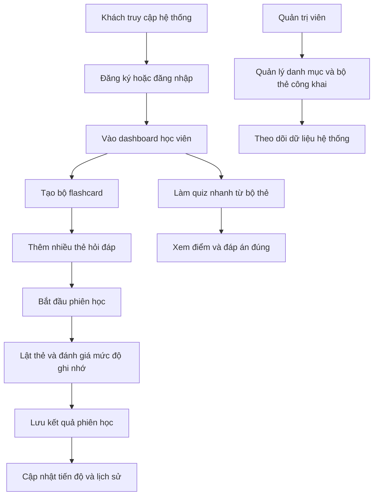

## 1. Tổng Quan Sản Phẩm
FlashLearn là mini project hỗ trợ học bằng flashcard, giúp người học tạo bộ thẻ, luyện tập theo phiên và theo dõi tiến độ ghi nhớ theo thời gian.
- Sản phẩm giải quyết nhu cầu ôn tập nhanh, học từ vựng/khái niệm theo chủ đề, và quản lý nội dung học tập trong một hệ thống đơn giản dùng Laravel + Blade.
- Giá trị chính là thể hiện rõ CRUD, quy trình học tập, theo dõi tiến độ, quản trị nội dung và logic nghiệp vụ phù hợp bài đánh giá môn học.

## 2. Tính Năng Cốt Lõi

### 2.1 Vai Trò Người Dùng
| Vai trò | Cách truy cập | Quyền chính |
|---------|---------------|-------------|
| Khách | Không cần đăng nhập | Xem trang giới thiệu, đăng ký, đăng nhập |
| Học viên | Đăng ký bằng email và mật khẩu | Quản lý bộ flashcard cá nhân, học flashcard, làm quiz nhanh, xem tiến độ |
| Quản trị viên | Tài khoản seed sẵn hoặc tạo thủ công | Quản lý danh mục, bộ flashcard công khai, người dùng, thống kê tổng quan |

### 2.2 Module Chức Năng
1. **Trang chủ**: giới thiệu hệ thống, CTA đăng ký, danh sách bộ flashcard nổi bật.
2. **Xác thực**: đăng ký, đăng nhập, đăng xuất, bảo vệ khu vực người dùng.
3. **Bảng điều khiển học viên**: tóm tắt tiến độ, số bộ thẻ, số lượt học, bộ cần ôn tập.
4. **Quản lý bộ flashcard**: tạo, sửa, xóa bộ thẻ; thêm thẻ hỏi/đáp; gắn danh mục và mức độ.
5. **Phiên học flashcard**: lật thẻ, đánh dấu đã nhớ/chưa nhớ, ghi nhận kết quả từng thẻ.
6. **Quiz nhanh**: sinh câu hỏi trắc nghiệm từ flashcard để tự kiểm tra.
7. **Lịch sử và tiến độ**: thống kê số thẻ đã học, tỷ lệ ghi nhớ, hoạt động gần đây.
8. **Khu vực quản trị**: quản lý danh mục, bộ thẻ công khai, tài khoản người dùng.

### 2.3 Chi Tiết Trang
| Tên trang | Module | Mô tả chức năng |
|-----------|--------|-----------------|
| Trang chủ | Hero, giới thiệu lợi ích, bộ nổi bật | Hiển thị định hướng dự án, nút đăng ký/đăng nhập, một số bộ thẻ công khai |
| Đăng ký / Đăng nhập | Form xác thực | Người dùng tạo tài khoản và truy cập hệ thống |
| Dashboard học viên | Thống kê nhanh, hoạt động gần đây | Tổng hợp số bộ thẻ, số thẻ, số phiên học, bộ cần ôn |
| Danh sách bộ thẻ | Bảng/Thẻ danh sách, tìm kiếm, lọc | Xem toàn bộ bộ thẻ cá nhân, lọc theo danh mục và trạng thái |
| Tạo / sửa bộ thẻ | Form thông tin bộ thẻ | Nhập tên bộ, mô tả, danh mục, trạng thái công khai |
| Quản lý thẻ học | Danh sách thẻ, form CRUD | Thêm câu hỏi, đáp án, ghi chú, mức độ khó cho từng flashcard |
| Phiên học | Khu vực lật thẻ, nút phản hồi | Hiển thị mặt trước/mặt sau, chấm mức độ nhớ, chuyển thẻ tiếp theo |
| Quiz nhanh | Câu hỏi trắc nghiệm | Tạo bài kiểm tra ngắn từ các thẻ để ôn tập |
| Tiến độ học tập | Biểu đồ/tổng hợp số liệu | Thống kê tỷ lệ nhớ, lịch sử học, bộ thẻ học nhiều nhất |
| Trang quản trị | Quản lý danh mục, người dùng, bộ công khai | Admin kiểm soát dữ liệu hệ thống và nội dung mặc định |

## 3. Quy Trình Cốt Lõi
Người dùng đăng ký tài khoản, tạo một bộ flashcard mới, thêm các thẻ hỏi/đáp, sau đó bắt đầu một phiên học. Trong mỗi phiên, hệ thống ghi nhận phản hồi "đã nhớ" hoặc "chưa nhớ" để cập nhật tiến độ. Người dùng có thể làm quiz nhanh từ bộ thẻ vừa tạo và xem lịch sử kết quả trong dashboard.

Quản trị viên có thể tạo danh mục học tập, duyệt hoặc quản lý các bộ thẻ công khai, và theo dõi số lượng người dùng cũng như nội dung đang hoạt động.

## 4. Thiết Kế Giao Diện
### 4.1 Phong Cách Thiết Kế
- Màu chủ đạo: xanh navy, xanh ngọc và trắng kem để tạo cảm giác học tập tập trung và thân thiện.
- Màu phụ trợ: vàng nhạt cho điểm nhấn ở badge, trạng thái và nút CTA.
- Nút bấm: bo tròn vừa phải, rõ trạng thái hover, ưu tiên dễ dùng hơn phô trương.
- Font chữ: sans-serif hiện đại, phân cấp rõ tiêu đề, nội dung và số liệu thống kê.
- Bố cục: sidebar hoặc top navigation rõ ràng, dashboard dạng card, form dễ nhập liệu.
- Biểu tượng: dùng icon học tập như sách, thẻ, đồng hồ, biểu đồ để hỗ trợ nhận biết nhanh.

### 4.2 Tổng Quan Thiết Kế Trang
| Tên trang | Module | Thành phần UI |
|-----------|--------|---------------|
| Trang chủ | Hero và bộ thẻ nổi bật | Banner lớn, card bộ thẻ, nút CTA rõ ràng, màu học tập thân thiện |
| Dashboard | Thống kê và nhắc ôn tập | Card số liệu, bảng hoạt động gần đây, nhãn trạng thái |
| Danh sách bộ thẻ | Tìm kiếm và lọc | Thanh tìm kiếm, bộ lọc danh mục, danh sách card hoặc bảng |
| Form bộ thẻ | Nhập dữ liệu | Form chia nhóm trường, validation message rõ ràng |
| Phiên học | Thẻ lật và điều hướng | Card trung tâm, nút lật thẻ, nút nhớ/chưa nhớ, tiến trình phiên |
| Quiz nhanh | Câu hỏi và kết quả | Khối câu hỏi, radio option, nút nộp bài, hộp kết quả |
| Trang quản trị | Quản lý dữ liệu | Bảng CRUD, badge trạng thái, hành động sửa/xóa/ẩn hiện |

### 4.3 Responsive
Thiết kế theo hướng desktop-first để phù hợp bài demo trên máy tính, sau đó co giãn tốt trên tablet và mobile. Menu sẽ thu gọn, bảng dữ liệu có thể chuyển thành card, vùng học flashcard vẫn ưu tiên thao tác chạm đơn giản.
